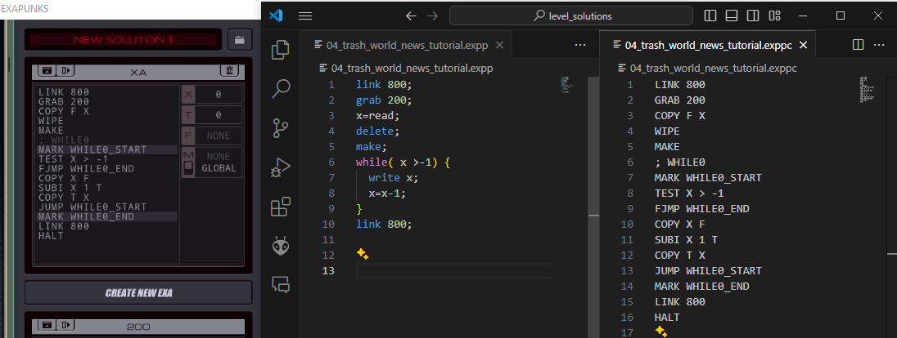

# Exa++
High level programming language for EXAPUNKS



Tired of tracking all that low-level code? Or, maybe just want to look at the same game from a different perspective?
Then you need to try **Exa++**.

The goals of the project:
- make a programming language that is easy to use
- beat all levels ot the game with it

# Features
- EXA definition syntax
- loops(forever, foreach, while, until)
- if-else conditions
- math expressions

Also you will get 30-50% more compact code and ease of readability.

Unfortunately, due to EXAPUNKS specifics, you have only one variable **'x'**(T, F and M are used internally). As i see so far, it's not a problem.

# Samples

Here is basic code sample that beats tutorial level 4:

```cpp
link 800;
grab 200;
x=read;
delete;
make;
while( x >-1) {
  write x;
  x=x-1;
}
link 800;
```
It compiles into EXAPUNKS low-level code:
```
LINK 800
GRAB 200
COPY F X
WIPE
MAKE
; WHILE0
MARK WHILE0_START
TEST X > -1
FJMP WHILE0_END
COPY X F
SUBI X 1 T
COPY T X
JUMP WHILE0_START
MARK WHILE0_END
LINK 800
HALT
```
For more samples check [Level solutions](level_solutions) directory.
The plan is to have a solutions for every level there.

# Usage

Make a `levels`(any name will work) folder for your code and copy `exppcli.exe` into it. Or just add `exppcli.exe` to your `PATH` environment variable.

Now open command prompt, enter the `levels` directory and execute
```
exppcli.exe --w .
```
Instead of `.` you can specify absulute path to your code directory. The cli will start watching all file changes in specified directory and compile the code for all files in there.

Or you can just run
```
exppcli.exe my_code.expp
```
to compili specified file once.

# Documentation
Check our [Wiki](https://github.com/TesAnti/ExaPlusPlus/wiki).
